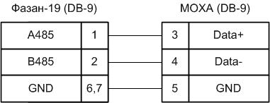

# fazan_19P50
Это консольное приложение для управления радиостанцией Фазан 19Р50/19Р5

**Доступые опции:**
- --connect <ip/host>:<port> порта. Пример: 192.168.127.254:4002
- --device Номер устройства   [default: 1]
- --freq Установить рабочую частоту
- --kf
  - 00 – частота с шагом сетки 8,33 кГц;
  - 01 – частота с шагом сетки 25 кГц без смещения несущей;
  - 10 – частота с шагом сетки со смещением частоты вниз на 5 кГц;
  - 11 – частота с шагом сетки со смещением частоты вверх на 5 кГц;  [default: "01"]
- --noiseSuppressor   Подавитель шума 0-выкл 1-вкл
- --enableTransmit    Включить излучение
- --disableTransmit   Выключить излучение
- --test              Запуск принудительного тестирования
- --id                Получить идентификатор РС
- --status            Чтение содержимого регистров
- --fullInfo, --info  Тоже самое что и status, но без пропуска неактивных ошибок
- --reg               Запись произвольного бита в регистр. Пример: MR1:7:1
- --nocolor           Монохромный вывод
- --help              Вывод справки  

## Примеры:
**Получение полной информации с радиостанции:**
```node app.js --connect 192.168.127.254:4002 --test --fullInfo```

**Получение краткой информации:**
`node app.js --connect 192.168.127.254:4002 --test --status`

**Установка частоты 133.5 МГц**
`node app.js --connect 192.168.127.254:4002 --freq 133.5 --status`

## Схема кабеля данных MOXA и Фазан19



Пользователь признает и соглашается с тем, что Приложение предоставляется на условиях «как есть». Разработчик не предоставляет гарантий в отношении последствий использования Приложения и схемы кабеля.
